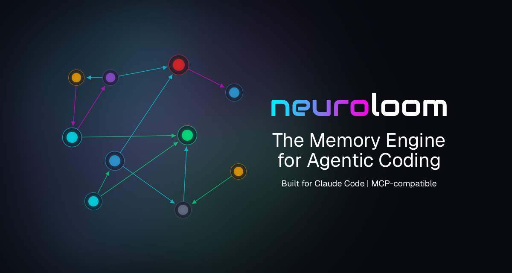

<p align="center">
  
</p>

Claude Code starts every session from scratch - context is lost and the CLAUDE.md grows out of date faster than your README.md. This plugin connects Claude to Neuroloom — the memory engine for agentic coding. Every tool use is captured, relationships between decisions are tracked, and each new session starts with the full graph of your past work.

Using Cursor, Codex or any other coding agent? See the [MCP Integration guide](https://neuroloom.dev/docs/mcp-integration) for the `.mcp.json` setup path.

---

## Prerequisites

- **Claude Code**
- **`python3`** >= 3.11

---

## Installation

### Install from Claude Code Marketplace (recommended)

1. Add the Endless Galaxy Studios marketplace:
   ```bash
   /plugin marketplace add endless-galaxy-studios/claude-plugins
   ```

2. Install Neuroloom:
   ```bash
   /plugin install neuroloom@endless-galaxy-studios
   ```

3. Configure your API key:
   ```bash
   /plugin
   Navigate to Installed --> neuroloom Plugin --> Configure options
   ```
   
4. Restart Claude Code, then verify:
   ```bash
   /neuroloom:status
   ```

#### To upgrade:

```bash
/plugin marketplace update endless-galaxy-studios
```

### Install via pip

1. Install the MCP server:
   ```bash
   pip install neuroloom-mcp
   ```
   
2. Install the plugin:
   ```bash
   neuroloom-mcp install-plugin
   ```

3. Restart Claude Code.

4. Set your API key with `/plugins configure neuroloom` in Claude Code.

#### To upgrade:

To update the MCP server:
   ```bash
   pip install --upgrade neuroloom-mcp
   ```

To update the plugin:
   ```bash
neuroloom-mcp install-plugin --force
   ```

---

## Post-Installation

1. Add `.neuroloom.db` to your project's `.gitignore` — it contains session state and lives in your project root no matter what installation method you use

2. Initialize workspace memory:
   ```bash
   /neuroloom:init
   ```
   This crawls your codebase in four phases: maps the directory structure, asks a question about priorities, stores 20–40 structured seed memories across your modules, and seeds the code graph with file-level symbols. After init, `memory_search` is useful from the first query.

## What the plugin does

- **Context injection** — before Claude reads a file, Neuroloom injects relevant memories (prior decisions, known gotchas, related patterns) directly into the conversation. Before Glob/Grep searches, it nudges Claude toward relevant memories it might want to query.
- **Observation capture** — every tool use is captured and sent to Neuroloom in the background. When the session ends, Neuroloom extracts structured memories and discovers relationships between them.
- **Code graph sync** — when you edit TypeScript or Python files, the plugin parses the file's structure (functions, classes, imports) via tree-sitter and syncs it to Neuroloom (support for other languages coming soon).
- **MCP tools** — Claude can query Neuroloom directly via `memory_search`, `memory_explore`, `memory_store`, `memory_by_file`, and others.

### Zero-touch bootstrap

`neuroloom-codeweaver` — the code graph sync package — is installed automatically on first SessionStart. No manual install step is needed after a marketplace install.

On the first session after installing the plugin, SessionStart creates a `.venv` inside the plugin directory and installs `neuroloom-codeweaver` into it in a background thread. If venv creation fails (for example, on macOS where the system Python has `ensurepip` stripped), it falls back to a `--user` install. A `--user` install lands in `~/.local/lib/...` on POSIX or `%APPDATA%\Python\` on Windows — visible to any code running under that interpreter, not isolated to the plugin venv.

If both paths fail, a banner appears in the Claude Code transcript explaining how to install manually:

```
python3 -m pip install neuroloom-codeweaver
```

**Offline or air-gapped environments:** Set `NEUROLOOM_CODEWEAVER_OFFLINE` to any non-empty value to skip all install attempts entirely. The banner will not fire. This is also useful in CI where `neuroloom-codeweaver` is pre-installed.

```bash
export NEUROLOOM_CODEWEAVER_OFFLINE=1
```

### How It Works

All hooks are Python modules in `pyhooks/`, launched via `run_hook.py`. When a `.venv` exists inside the plugin directory, hooks run inside it; when it does not, the system Python that invoked the launcher is used as a fallback so all non-codeweaver hooks still run. State is stored in a single SQLite database (`.neuroloom.db`) using WAL mode for concurrent access.

**SessionStart** — opens a Neuroloom session, replays any buffered observations from the previous session, injects the memory-first rule into `CLAUDE.md` if absent, and prints the tool catalog so Claude knows what's available.

**PreToolUse (context injection)** — fires before `Read`, `Glob`, and `Grep`. Two modes:
- **Inject** (on `Read`) — queries Neuroloom's context endpoint with the file path and injects relevant memories as `additionalContext` before Claude sees the file.
- **Nudge** (on `Glob`/`Grep`) — extracts a meaningful query from the search pattern and injects a compact reminder to check Neuroloom for related context.

Includes a circuit breaker (30s cooldown on API failures), response caching (1hr TTL), and a per-session token budget (~30K chars) to avoid flooding the context window.

**PostToolUse (capture)** — fires after every tool use. Reads the tool event from stdin, applies guard checks (no API key, no session, MCP self-calls, rate throttle), and ships the observation to Neuroloom in a background thread. If the API is unreachable, the payload is buffered in the SQLite `event_buffer` table for replay on the next session start. Exits in under 100ms.

**PostToolUse (code graph sync)** — fires on `Write` and `Edit`. Parses code files to extract functions, classes, and imports via tree-sitter, then syncs the structure to Neuroloom.

### Session Tracing

All hook decisions are recorded in the `traces` table of the SQLite database for post-hoc debugging. Traces capture what each hook decided and why, so you can replay the decision log instead of guessing.

### Code Graph Sync

When you edit TypeScript or Python files, the plugin automatically parses each file's structure — functions, classes, and imports — and syncs it to Neuroloom in the background via the `neuroloom-codeweaver` package. No manual install or calls needed — see [Zero-touch bootstrap](#zero-touch-bootstrap) above. The package is also checked for updates at each session start and upgraded in the background when a newer version is available on PyPI.

---

## Skills Reference

| Command | Description |
|---------|-------------|
| `/neuroloom:init` | Bootstrap workspace memory — crawls the codebase, stores structured seed memories, and seeds the code graph |
| `/neuroloom:status` | Check session health, buffer depth, and connection |

---

## Troubleshooting

**No observations appearing in the Neuroloom dashboard**

Run `/neuroloom:status` to check that your API key is detected. If the config source shows `unknown`, re-run `/plugins configure neuroloom` to set your key, then restart Claude Code.

**Context not injecting at session start**

Run `/neuroloom:status` to check if a session is active. If not, the SessionStart hook may not have fired — try restarting Claude Code.

**MCP connection fails**

Run `/neuroloom:status` to verify your API key is configured. If the config source shows `unknown`, re-run `/plugins configure neuroloom` to set your key.
